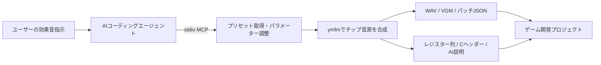

# RETRO / SFX — Retro SFX Studio

MSX / PC-9801 / X68000向け効果音を編集する、ローカル動作のシンセサイザーです。
黒いハードウェアパネル、黄緑LCD、回転ノブ、波形・包絡表示、鍵盤を備えています。
**MCPを通じた、AIによる多音源チップ対応の効果音生成**に対応しています。
人がノブで音を作るGUIと、AIが音色パラメーターを調整・合成・出力するMCPサーバーを同じ音源エンジンで提供します。

[Windows版ダウンロード](https://github.com/kanon-ai/retro-sfx-studio/releases/latest) · [MCP接続](MCP_SETUP.md) · [免責事項](DISCLAIMER.md) · [MIT License](LICENSE)

## 特長

- **5種類の音源チップ**：PSG（YM2149）、OPLL（YM2413）、OPN（YM2203）、OPNA（YM2608）、OPM（YM2151）。
- **AIから直接音を作る**：MCPでプリセットを取得し、ピッチ・包絡・FMオペレーターを設定してWAV/VGMなどを生成。
- **レトロゲーム開発へ受け渡す**：編集用パッチJSON、レジスター列、Cヘッダー、AI向け説明、ハッシュをまとめて出力。
- **視覚的な音作り**：回転ノブ、LCD波形表示、ピッチ／包絡グラフ、鍵盤、8ステップの音程変化、52プリセット。
- **ローカル合成**：本ツールの実行にクラウドAPI・GPU・ユーザー所有のBIOSや外部音源ROMは不要。
- **Windows x64実行ファイル**：Pythonを別途インストールせず使用可能。ソースから実行する場合のPython追加パッケージも不要。

「多音源チップ対応」は出力対象として複数種類のチップを選べることを意味します。
1回の生成・編集は1チップ／1チャンネルであり、複数チップの同時演奏やBGMシーケンサー機能はありません。
AIモデルは同梱しません。自然言語による指示は接続先AIが解釈し、本ツールはMCP経由の設定で音源を合成します。

## English overview

**Retro SFX Studio is a local, MCP-enabled sound-effects synthesizer for MSX, PC-9801 and X68000 game development.**
An AI coding agent can select presets, edit chip parameters, render audio and export a complete integration package using six MCP tools.
The same ymfm-based renderer powers a hardware-inspired GUI with rotary controls, waveform/envelope displays and a keyboard.

Supports YM2149 PSG, YM2413 OPLL, YM2203 OPN, YM2608 OPNA and YM2151 OPM (one chip/channel per render).
Exports WAV, VGM, editable patches, register timelines, C headers and AI handoff notes.
No AI model, external sound ROM or cloud synthesis service is bundled or required for local rendering.
An AI model and a compatible stdio MCP client are needed for AI-assisted operation.
Windows x64 downloads are available under [Releases](https://github.com/kanon-ai/retro-sfx-studio/releases).
See [limitations and disclaimer](DISCLAIMER.md).

## 起動

Releasesから `RetroSFX-Studio-v1.1.0-win-x64.zip` をダウンロードし、**ZIP全体を展開**してください。`_internal` フォルダーも必要です。
ソースから利用する場合は先にネイティブエンジンをビルドし、`start.bat` を実行します（後述）。`dist/RetroSFX/RetroSFX.exe` がある場合はそちらを優先します。
配布フォルダーからは `RetroSFX.exe` をダブルクリックします。ブラウザーで http://127.0.0.1:7911 が開きます。
サーバーのコンソールを閉じるかCtrl+Cで終了します。既に起動中の場合は画面を開き直します。

Pythonから直接実行する場合は `python server.py`（Python 3.10以降、追加パッケージ不要）。
ポート変更は `python server.py --port 7912` または `RetroSFX.exe --port 7912`。
アプリは127.0.0.1だけで待ち受けます。インターネットへの公開機能はありません。

## 対応音源

| マシン | 音源 | 編集対象 | クロック |
|---|---|---|---|
| MSX | PSG / YM2149 | 矩形波・ノイズ、Aチャンネル | 1,789,773 Hz |
| MSX | OPLL / YM2413 | ユーザー2op音色 + 内蔵15音色、CH.1 | 3,579,545 Hz |
| PC-9801 | OPN / YM2203 | 4op FM、またはSSG | 3,993,600 Hz |
| PC-9801 | OPNA / YM2608 | 4op FM、またはSSG | 7,987,200 Hz |
| X68000 | OPM / YM2151 | 4op FM、ステレオ | 4,000,000 Hz |

PSGはYM2149モデルです。AY-3-8910搭載MSXとは音量特性等が異なります。
OPNAのADPCM・リズム、OPMのノイズ、複数チャンネル同時編集は未対応です。
実機の出力回路やローパス特性は模擬していません。実機動作は未検証です。

## 操作

1. 上部で音源、PROGRAMでプリセットを選択します（52種）。
2. ノブを上下ドラッグ、矢印キー、数値入力で調整します。Shift+ドラッグは細かく調整します。
3. PLAYまたはSpaceで試聴します。STOPで停止。LOOPは試聴中だけ繰り返します。
4. 鍵盤をクリックすると基準音を変更し、その音程で効果音全体を再生します。
5. パッチ保存で編集可能なJSONを保存。「読込」で復元できます。ブラウザーにも自動保存します。
6. Ctrl+Z / Ctrl+Shift+Zでパラメーター操作を戻す／やり直します。数値欄に入力中は通常のテキスト編集を優先します。

### パラメーター

- NOTEはMIDIノート番号。SWEEPは半音差、CURVEはスイープの形。DEPTH/RATEはビブラート。
- LENGTHは発音時間。A/Dの合計が長すぎる場合、LENGTH−RELEASEに収まるよう比例調整します。Rは発音時間の末尾に入ります。TAILは終了後の余白です。
- AMPLITUDEは音源の音量レジスターを240 Hzで更新する包絡です。音源の量子化幅に従います。
- FMオペレーターのAR/DR/SR/SL/RRは音源固有の包絡パラメーターで、秒数ではありません。AR=0では新しい音が立ち上がりません。
- TLは大きいほど減衰。MUL=0は0.5倍。OPLLのMULはチップ固有の倍率表（10/10、12/12、15/15を含む）に従います。
- OPLLの内蔵音色選択時はユーザー音色の編集部を無効表示します。
- STEP MOTIONは8ステップの半音オフセット。発音を8等分し、キーを再トリガーせずピッチを変化させます。
- 周波数が音源の範囲を外れる場合はレジスターの上下限に制限されます。
- MONITORは試聴専用で、書き出しには影響しません。PANはOPNA/FMとOPMだけに適用します。

## 音色サンプル・テンプレート

**5音源 × 8種 = 40テンプレート**を収録しています。既存12種と合わせて52プリセットです。

| 音源ごとに用意した音色 | 用途 |
|---|---|
| コイン / 決定音 | アイテム取得・メニュー操作 |
| ジャンプ / レーザー | アクション・ショット |
| 爆発・衝撃 / ベル | ヒット・通知 |
| 警報 / パワーアップ | 警告・獲得演出 |

- GUI：PROGRAM **13〜52** から音源名付きの音色を選択。
- MCP：`list_presets` で検索し、`get_preset` の **index 12〜51** で取得。
- 個別読込：`templates/patches/` のJSONを「読込」で開く。
- 試聴：[一覧とWAVサンプル](templates/README.md)。[Releases](https://github.com/kanon-ai/retro-sfx-studio/releases/latest)の **RetroSFX-Templates-v1.1.0.zip** を展開し、`preview.html`を開くと音源別に試聴できます。
- ソースからの再生成：`python tools/build_templates.py`（ネイティブ音源エンジンが必要）。

テンプレートのパッチデータ・WAV・catalog.jsonは **CC0-1.0**。ゲームへの利用・改変にクレジットは必須ではありません。
詳しくは[テンプレートの説明](templates/README.md)と[CC0ライセンス](templates/LICENSE)を参照してください。
ツール本体と試聴ページのコードは従来どおりMITです。

## 出力

- WAV: 44.1 kHz / PCM 16-bit / stereo。DC除去と固定0.8倍ゲインあり。
- VGM: v1.71。試聴に使うレジスター列と同じ内容。WAVの後処理は含みません。
- REG JSON: 44,100 Hz単位の絶対時刻、レジスター、値、音源クロック。
- C HEADER: 待ち時間が差分のC配列。実機用I/Oドライバーは別途必要です。
- 説明をコピー / 説明.md: AI向けの仕様、完全なパッチ、レジスター列、組み込み条件。
- AI用パッケージ ZIP: 上記データ、WAV、VGM、SHA-256マニフェストを一括出力。

AIへはZIPを展開して `AI_HANDOFF.md` と必要な音声・設定ファイルを渡してください。
パラメーターが変わったら波形は古い状態として表示されるため、PLAYで再生成してください。

## MCP

AIからプリセット取得、音色設定の検証、WAV生成、AI引き渡し一式の出力が可能です。
GUIやWebサーバーの起動は不要。**ローカルstdio MCP**で接続します。
設定例と全ツールの説明は [MCP_SETUP.md](MCP_SETUP.md) を参照してください。



例えばASTRAなどを利用する開発環境から、次のように依頼できます。

> retro-sfx MCPでMSX用のPSGジャンプ音を作ってください。0.35秒で低音から高音へ変化させ、
> export_soundでWAV、VGM、レジスター列と説明を出力してください。
> 既存のBGMチャンネルを維持し、ゲーム側のサウンドドライバーに合わせて組み込んでください。

接続するAIクライアント側のMCP対応とファイルアクセス権が必要です。特定モデル／製品との動作保証ではありません。
MCPクライアントを使わない場合も、GUIの「説明をコピー」「説明.md」「AI用パッケージZIP」で同じ情報をAIへ渡せます。

| MCPツール | 用途 |
|---|---|
| `list_presets` | 音源・プリセット一覧 |
| `get_preset` | 編集可能なパッチ取得 |
| `validate_patch` | 設定検証とイベント件数確認 |
| `render_sound` | WAVとパッチの生成 |
| `export_sound` | ゲーム開発用のデータ一式とZIP出力 |
| `get_handoff_text` | 組み込み仕様とレジスター列をテキスト取得 |

## 実機への組み込み

チャンネル0（画面ではCH.1、PSG/SSGはA）の単独再生データです。
既存BGMとのチャンネル調停、共有音色、PSG R7のI/O方向ビット保存、チップごとのBUSY待ち、
ターゲットのタイマーに合わせた再生ドライバーが必要です。60 Hzへ単純に丸めると音が変わります。
本ツールはROMや実機用ドライバーを自動生成しません。

## 開発・検証

音源エンジン: [ymfm](https://github.com/aaronsgiles/ymfm)（BSD 3-Clause）。固定版とライセンスは `THIRD_PARTY.md`。

```powershell
cmake -S . -B build -A x64
cmake --build build --config Release
python -m unittest discover -s tests -v
```

WindowsでのソースビルドにはVisual Studio 2022のC++開発ツール、Windows SDK、CMakeが必要です。
ネイティブエンジンをビルド後、`python server.py` でGUI、`python mcp_server.py` でMCPサーバーを起動できます。
上のコマンドで作成した `build/Release/retro_render.exe` は自動検出されます。

Windows用パッケージを再生成する場合:

```powershell
python -m pip install -r requirements-dev.txt
.\build.ps1
python tools/package.py
```

`build.ps1` は `dist/RetroSFX/`、`tools/package.py` は `releases/` に配布物を作成します。
依存するymfmのソースとライセンスはvendorに固定版を収録しています。git submoduleの取得は不要です。
通常利用には開発ツールやPythonのインストールは不要です。

検証には全音源の440 Hz測定、左右出力、ゼロ音量、52プリセットの再現性、
VGMイベントの完全復元、ZIPのハッシュとパッチ復元、MCP別プロセスからの生成を含みます。

## ファイル構成

`static/`: UI / `engine.py`: パッチ・レジスター変換 / `native/render.cpp`: 音声生成 /
`server.py`: GUI用HTTP / `handoff.py`: AI出力 / `mcp_server.py`: stdio MCP /
`outputs/`: MCPが生成したファイル（毎回新しいフォルダー）。


## ライセンス・免責事項

- 本プロジェクトの独自コードと文書は **[MIT License](LICENSE)** で公開しています。
- ymfmは **BSD 3-Clause**。Python、PyInstaller、OpenSSL等はそれぞれのライセンスが適用されます。
  詳細・著作権表示・同梱ライセンスは [THIRD_PARTY.md](THIRD_PARTY.md) を参照してください。
- 無保証、実機未検証、生成データ利用時の責任範囲、商標・非公式性は **[DISCLAIMER.md](DISCLAIMER.md)** に記載しています。
- 不具合報告には、音源、再現手順、パッチJSON、OS、バージョンを添えてください。秘密情報や個人情報は含めないでください。
